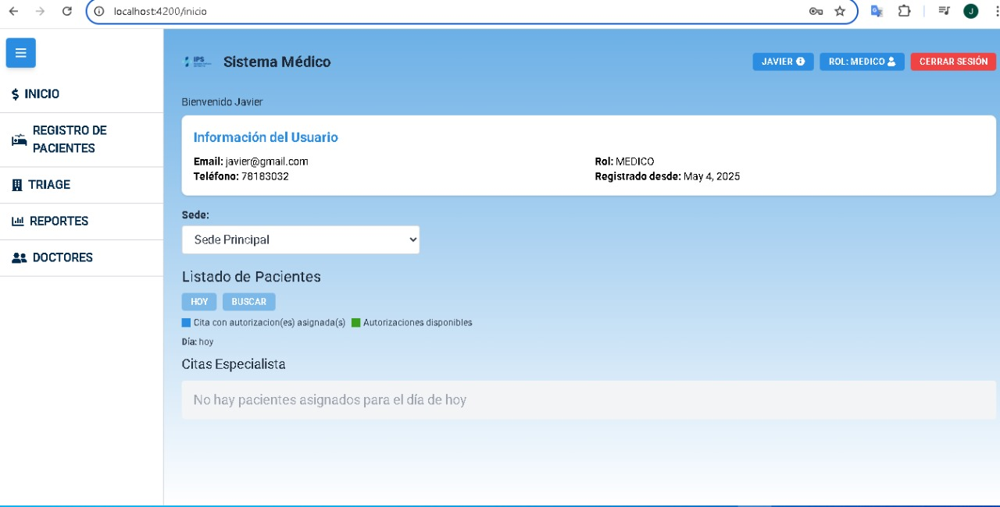
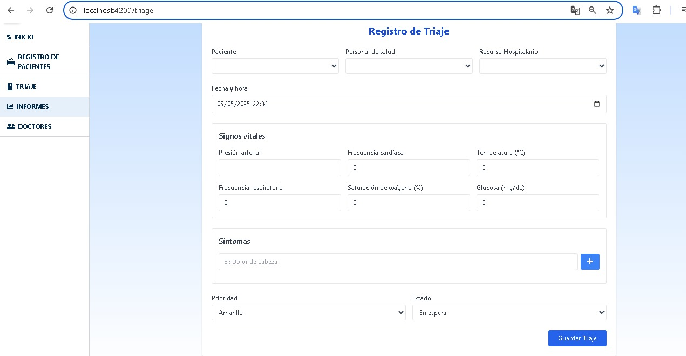
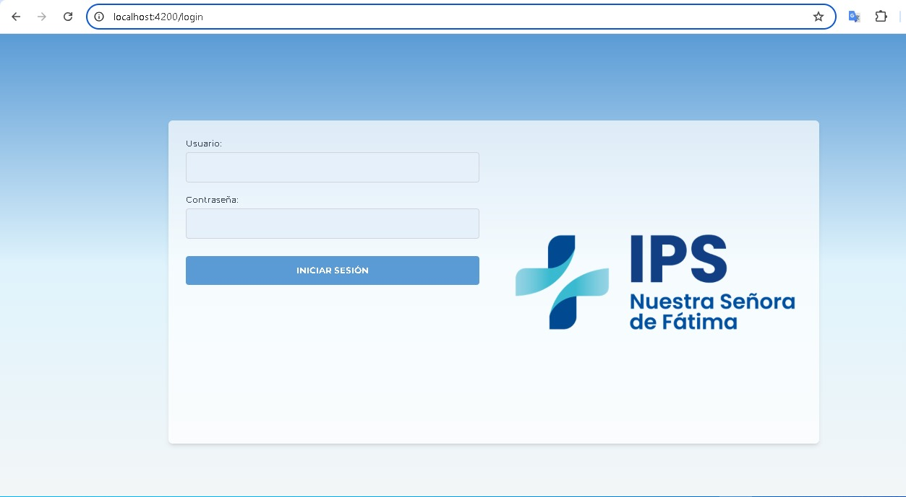

# ProyectoFinalTriaje
Sistema web de triaje hospitalario desarrollado con Angular (frontend) y Laravel (backend). Este proyecto permite gestionar pacientes, personal de salud, recursos hospitalarios, inventarios, y más.

# 📸 Capturas de Pantalla

# Formulario de triaje

# Formulario de Login

# Formulario de Paciente

# 🛠 Manual de Instalación
Requisitos
Node.js (v18 o superior)

Angular CLI

Git

Laravel (para backend)

MySQL o MariaDB

PHP 8.1 o superior

Paso 1: Clonar el repositorio

  git clone https://github.com/tu-usuario/ProyectoFinalTriaje.git
  cd ProyectoFinalTriaje

Paso 2: Instalar dependencias de Angular

  npm install

Paso 3: Iniciar el servidor Angular

  ng serve
  Accede a la app en: http://localhost:4200

Paso 4: Instalar y configurar el backend (Laravel)
  Ve a la carpeta del backend (si está en una subcarpeta como backend/)

Instala las dependencias:

composer install
Copia el archivo .env.example a .env y configura tu base de datos.

Genera la clave de la aplicación:

php artisan key:generate
Importa la base de datos (ver siguiente sección).

Inicia el servidor backend:

php artisan serve
# 🗃 Copia de la Base de Datos
Dentro del repositorio del proyecto tendras que levantar el servidor laragon y abrir el proyecto ApiTriaje en Visual Code. Atraves de la terminal de Laragon debes Dirigirte a la carpeta ApiTriaje y ejecutar el comando "Php Artisan Migrate" esta hará una migracion de todas las talblas.
Nota: Previamente ya debe crearse una base de Datos en HeidiSQL con el Nombre de ApiTriaje. Verificar así mismo que tu usuario y contraseña de la conexion sean las mismas

# 🧑‍💻 Autores
Javier Ortuño 
Juan Diego Aguilera
Jarlen 

# 📄 Licencia
Este proyecto está bajo la Licencia MIT. Consulta el archivo LICENSE para más detalles.
